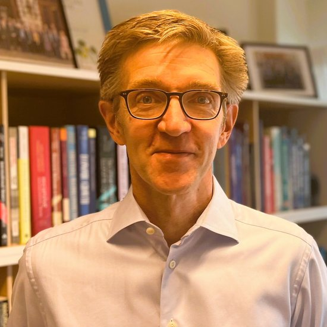

I am a macroeconomist in the [Department of Economics at Stockholm University](https://www.su.se/english/divisions/department-of-economics)

  

## Recent Activities

- Chapter in report on Sweden and the Euro (March 2026): [Has the floating exchange rate contributed to macroeconomic stability?](files/MF2026_euro_chapter.pdf)
  ([full report](https://frittnaringsliv.se/time-for-swedish-euro-membership/) | [Swedish version](https://frittnaringsliv.se/dags-for-euron/))
- Op-ed: [En oberoende centralbank -- med ett snävt mandat](https://martinfloden.net/files/DI_debatt_260120.pdf) (in Swedish), Dagens Industri, January 20, 2026

## Short Bio

### Current
- Professor of Economics, Stockholm University, since 2010 (on leave 2013-2024)
- [CEPR](https://cepr.org/), Research Fellow
- [Swedish Financial Supervisory Authority](https://fi.se/en/), Deputy Chair
- [Swedish National Debt Office](https://www.riksgalden.se/en/), Advisory Scientific Council
- [Swedish Economic Association](https://www.nationalekonomi.se/), Deputy Chair
- [Assar Lindbeck Center](https://www.su.se/enheter/assar-lindbeck-centrum), Board Member
- [CeMoF](https://www.su.se/english/divisions/center-for-monetary-policy-and-financial-stability), Management Team

### Sveriges Riksbank
- Deputy Governor and Member of the Executive Board, 2013-2024
- International assignments: OECD WP3 (2013-2024), Bellagio Group (2013-2024), Basel Committee on Banking Supervision (2020-2024), FSB Regional Consultative Group (2020-2024)

### Stockholm School of Economics
- Associate Professor 2005-2009
- Assistant Professor 2001-2005
- Research Associate 1999-2001

### Selected Other Previous Activities
- Journal of Economic Dynamics and Control, Associate Editor 2010-2013
- Fiscal Studies, member of the editorial board, 2007-2013
- Swedish National Debt Office, board member 2012-2013
- Swedish Fiscal Policy Council, member, 2007-2010
- Swedish Economic Council, member, 2006-2007
